# Zing — AI Startup Builder

**Zing** turns a startup brief into an investor-ready package using six coordinated Gemini-powered agents.

Given a single startup idea, Zing researches the market, builds the business strategy, creates financial projections, develops the brand, generates a launch-ready website, and produces an investor pitch deck — all through one coordinated AI workflow.

## 🚀 Live Demo

<p align="center">
  <a href="https://zing.hamrolearning.com">
    <strong>🌐 Launch Zing → zing.hamrolearning.com</strong>
  </a>
</p>

<p align="center">
  <em>Turn one startup idea into a complete investor-ready package.</em>
</p>

---

## 🏆 The Hackathon Challenge

The Hackathon challenge is to **build the most sophisticated AI agent possible with MutagenT/Mutagent and push the system to its limits**.

The challenge encourages ambitious agents that can perform real jobs using tools, integrations, triggers, and complex agentic workflows.

The strongest submissions demonstrate:

1. **Sophisticated agents** — ambitious workflows, multiple capabilities, tools, and integrations.
2. **Self-evolving loops** — systems that can evaluate and improve their own performance.
3. **Extensions to the base system** — new stages, commands, or skills that extend the MutagenT ecosystem.
4. **Proof that it works** — measurable evaluation criteria, datasets, and passing scorecards.
5. **Actionable product feedback** — useful feedback submitted through the MutagenT feedback system.

### What the challenge expects

* Agent code
* Session transcripts
* Subagent transcripts
* Complete execution traces
* Evaluation results
* Product feedback

Zing is designed around these principles by combining **multiple specialized AI agents**, structured execution, generated artifacts, and **Mutagent tracing** into one end-to-end startup-building workflow.

---

## 💡 Our Approach — Zing

Most startup-building workflows require founders to manually move between market research, business planning, finance, branding, web development, and fundraising.

**Zing turns that fragmented process into a single agentic pipeline.**

```text
                         ┌─────────────────┐
                         │  Startup Idea   │
                         └────────┬────────┘
                                  │
                                  ▼
                    ┌─────────────────────────┐
                    │    Zing AI Workspace    │
                    └────────────┬────────────┘
                                 │
             ┌───────────────────┼───────────────────┐
             │                   │                   │
             ▼                   ▼                   ▼
      Market Research      Business Strategy    Financial Plan
             │                   │                   │
             └───────────────────┬───────────────────┘
                                 │
                                 ▼
                         Brand Identity
                                 │
                                 ▼
                          Launch Website
                                 │
                                 ▼
                           Pitch Deck
                                 │
                                 ▼
                  ┌─────────────────────────┐
                  │ Investor-Ready Startup  │
                  │        Package          │
                  └─────────────────────────┘
```

Each specialist agent focuses on a different part of the startup lifecycle while sharing the overall context of the build.

---

## 🧩 Agent Workflow

Zing orchestrates six Gemini-powered agents that transform a startup idea into a complete startup package.

<p align="center">
  
</p>

<p align="center">
  <em>Six coordinated AI agents working together to build a complete startup package.</em>
</p>

---

## 🤖 The Six Agents

| Agent                    | Responsibility                                                                 | Output                 |
| ------------------------ | ------------------------------------------------------------------------------ | ---------------------- |
| 🔎 **Market Research**   | Understand the market, customers, competitors, and opportunities               | Market research report |
| 📊 **Business Strategy** | Define the business model, positioning, value proposition, and growth strategy | Business strategy      |
| 💰 **Financial Plan**    | Develop revenue assumptions, costs, projections, and financial model           | Financial plan         |
| 🎨 **Brand Identity**    | Create the startup's brand direction and positioning                           | Brand identity         |
| 🌐 **Launch Site**       | Turn the startup strategy into a launch-ready website                          | Landing page           |
| 🧑‍💼 **Pitch Deck**     | Transform the startup research and strategy into an investor presentation      | Investor pitch deck    |

---

## ✨ Key Features

* **Six coordinated AI agents**
* **Gemini-powered generation**
* **End-to-end startup generation**
* **Real-time agent progress tracking**
* **Shared build/run ID**
* **Mutagent execution tracing**
* **JSONL trace export**
* **Generated landing page preview**
* **Downloadable startup deliverables**
* **Investor-focused pitch deck generation**
* **Business and financial planning**
* **Brand strategy and identity generation**

---

## 🔥 What Makes Zing Agentic?

Zing is not a single prompt that generates a long response.

The system separates startup creation into **specialized agent responsibilities**.

```text
                    ┌─────────────────┐
                    │  Startup Brief  │
                    └────────┬────────┘
                             │
                             ▼
                   ┌──────────────────┐
                   │ Agent Orchestration│
                   └─────────┬────────┘
                             │
       ┌─────────────────────┼─────────────────────┐
       │                     │                     │
       ▼                     ▼                     ▼
   Research              Strategy              Finance
       │                     │                     │
       └─────────────────────┼─────────────────────┘
                             │
                             ▼
                          Branding
                             │
                             ▼
                       Launch Website
                             │
                             ▼
                         Pitch Deck
                             │
                             ▼
                    Complete Startup
                         Package
```

Each stage produces a specific deliverable that contributes to the final startup package.

This makes the workflow easier to inspect, trace, evaluate, and improve than a single monolithic generation call.

---

# 🧬 MutagenT / Mutagent Integration

MutagenT drives an **Agentic Development Lifecycle (ADL)** designed around structured agent development and evaluation.

The lifecycle is:

```text
① SPEC
    │
    ▼
② BUILD
    │
    ▼
③ EVALUATE
    │
    ▼
④ DIAGNOSE
    │
    ▼
⑤ OPTIMIZE
    │
    └───────────────────────↺
```

The system uses an orchestrator, **Helix**, to route work between specialized stages and subagents.

The core idea is to make agent development:

* Structured
* Observable
* Evaluatable
* Traceable
* Iterative
* Approval-gated

Zing incorporates the **observability and traceability side of this philosophy** into its startup-generation workflow.

---

## 🔍 Mutagent Tracing in Zing

Every Zing build has a shared **run ID**.

While a startup package is being generated, the **Mutagent trace** panel shows the execution of each agent.

The trace captures events such as:

* Agent started
* Agent completed
* Agent failed
* Execution duration
* Output size
* Run identification

This provides visibility into what the system is doing instead of treating the entire startup generation process as a black box.

### Trace export

The workspace provides a:

**Download JSONL**

control for exporting the complete run trace.

For the HackIndia / Mutagent submission, exported traces can be stored under:

```text
traces/
```

See [`MUTAGENT_TRACING.md`](./MUTAGENT_TRACING.md) for the trace format and server-side logging details.

---

## 📊 Evaluation & Proof

A major part of the hackathon challenge is demonstrating that the agent actually works.

For Zing, the generated package can be evaluated across multiple dimensions:

| Area              | Example Evaluation                                         |
| ----------------- | ---------------------------------------------------------- |
| Market Research   | Relevant competitors and market information are identified |
| Business Strategy | Strategy aligns with the supplied startup idea             |
| Financial Plan    | Financial assumptions are internally consistent            |
| Brand Identity    | Brand direction matches the startup positioning            |
| Launch Site       | Website reflects the generated startup strategy            |
| Pitch Deck        | Deck communicates the opportunity clearly                  |
| Agent Execution   | All expected agents complete successfully                  |
| Traceability      | Agent execution is represented in the Mutagent trace       |

The Mutagent trace provides the execution evidence needed to inspect how the final package was produced.

---

## 📦 Generated Deliverables

A completed Zing build can produce:

```text
Market Research
Business Strategy
Financial Plan
Brand Identity
Launch Landing Page
Investor Pitch Deck
Mutagent JSONL Trace
```

The generated landing page can be previewed directly inside the workspace and exported as standalone HTML.

---

## 🚀 Quick Start

### 1. Clone the repository

```bash
git clone https://github.com/HackIndiaXYZ/hackindia-spark-11-hyderabad-telangana-south-central-region-zaya-code-hub.git
cd hackindia-spark-11-hyderabad-telangana-south-central-region-zaya-code-hub
```

### 2. Install dependencies

Use **Node.js 18 or newer**.

Node.js 20 LTS is recommended.

```bash
npm install
```

### 3. Configure Gemini

Create a local environment file:

```bash
cp .env.local.example .env.local
```

Open `.env.local` and add your Gemini API key:

```env
GEMINI_API_KEY=your_gemini_api_key_here
```

Get a Gemini API key from [Google AI Studio](https://aistudio.google.com/apikey).

> **Important:** Never commit `.env.local` or expose your Gemini API key.

### 4. Start the development server

```bash
npm run dev
```

The application will be available at:

```text
http://localhost:3000
```

Routes:

* **Landing page:** `/`
* **AI workspace:** `/build`

---

## 🏗️ Generate a Startup Package

1. Open `/build`.
2. Enter a startup idea.

Example:

```text
AI-based agriculture startup using drone technology
```

3. Select **Send**.
4. Watch the six agents execute through the pipeline.
5. Review the output from each agent.
6. Use the download controls to save individual deliverables or the complete package.

The generated landing page is previewed directly inside the workspace.

Its standalone HTML can be downloaded from the **Launch Site** tab.

---

## 🧪 Checks

Run the following commands before submitting:

```bash
npm run lint
npx tsc --noEmit
npm run build
```

These verify:

* ESLint correctness
* TypeScript correctness
* Production build integrity

---

## 📁 Project Structure

```text
app/
  build/                  # Interactive six-agent workspace
  api/mutagent/           # Streaming Gemini routes for every specialist

components/               # Shared UI components and agent icons

lib/
  gemini.ts               # Gemini streaming client
  agent-trace.ts          # Structured server-side trace events

public/
  zing-pipeline.svg       # Animated six-agent workflow diagram

traces/                   # Exported Mutagent JSONL traces

MUTAGENT_TRACING.md       # Trace capture and export instructions
```

---

## 🧩 Submission Artifacts

For the hackathon submission, the important artifacts include:

### Agent code

The complete Zing implementation is contained in this repository.

### Workflow

The animated pipeline diagram documents the six-agent architecture:

```text
public/zing-pipeline.svg
```

### Traces

Mutagent JSONL traces produced during Zing runs can be stored under:

```text
traces/
```

### Documentation

Trace implementation and export details:

```text
MUTAGENT_TRACING.md
```

### Evaluation

The generated startup package can be evaluated against the quality and consistency criteria described above.

---

## 🏆 Why Zing?

Building a startup usually requires jumping between multiple tools:

```text
Idea
 ↓
Market Research Tool
 ↓
Business Planning
 ↓
Financial Modeling
 ↓
Branding
 ↓
Website Builder
 ↓
Pitch Deck Tool
```

Zing brings those steps together:

```text
                     ZING
                       │
                 Startup Idea
                       │
                       ▼
              ┌────────────────┐
              │  AI Pipeline   │
              └───────┬────────┘
                      │
       ┌──────────────┼──────────────┐
       ▼              ▼              ▼
   Research        Strategy       Finance
       │              │              │
       └──────────────┼──────────────┘
                      │
                      ▼
                   Branding
                      │
                      ▼
                Launch Website
                      │
                      ▼
                  Pitch Deck
                      │
                      ▼
             Investor-Ready Package
```

The result is a single workflow that takes a founder from **idea → research → strategy → execution → presentation**.

---

## 🌐 Links

### Live Application

**https://zing.hamrolearning.com**

### Source Code

**https://github.com/HackIndiaXYZ/hackindia-spark-11-hyderabad-telangana-south-central-region-zaya-code-hub**

### Gemini API

**https://aistudio.google.com/apikey**

### MutagenT Documentation

**https://docs.mutagent.io**

---

## 🏁 Hackathon Goal

Zing is built around a simple idea:

> **One startup idea → Six specialized AI agents → One investor-ready startup package.**

By combining specialized agents, generated artifacts, real-time execution visibility, and Mutagent tracing, Zing demonstrates how an agentic system can take a complex real-world task and turn it into a structured, inspectable workflow.

---

<p align="center">
  <strong>🚀 Zing — From Idea to Investor-Ready Startup</strong>
</p>

<p align="center">
  <a href="https://zing.hamrolearning.com">
    <strong>Try Zing →</strong>
  </a>
</p>
